<div align="center">


# 🪷 Gita — The Eternal Wisdom

*A calm, offline-first way to read the Bhagavad Gita — verse by verse, chapter by chapter.*

[](https://github.com/GSMS-B/Gita-The-Eternal-Wisdom/releases/tag/v1.0.0)
[](LICENSE)
[](https://gsms-b.itch.io/gita-the-eternal-wisdom)

</div>

*(Drop your banner image into the `/screenshots` folder in the repo as `banner.png` — the tag above will pick it up automatically.)*

---

## 🕉️ About

**Gita — The Eternal Wisdom** is a fully offline Flutter app for reading the Bhagavad Gita — all 18 chapters, all ~700 verses — in the original Sanskrit, with transliteration, translation, and commentary from **22 different scholars and translators**, not just one. There's no login, no account, no server, no ads, and no internet connection required to read a single verse. Everything — your bookmarks, your reading progress, your preferences — stays on your device.

Built as a portfolio project combining two long-standing interests: Indian philosophy, and building something end-to-end.

## ✨ Features

- 📖 **All 18 chapters, ~700 verses** — Sanskrit (Devanagari), transliteration, translation, and purport
- 🗣️ **22 translation & commentary sources** — switch your preferred translator any time from Settings → Translation Preferences, each tagged by what it offers (English Translation / English Commentary / Hindi Translation / Sanskrit Commentary)
- 🧘 **Meditation Mode** — a quiet, ambient screen with music, separate from the reading experience
- 🔖 **Bookmarks** — save any verse for quick return later
- 📊 **Reading progress** — per-chapter and overall, always picks up where you left off
- 🔤 **Adjustable font size & transliteration toggle** — built for comfortable long reading sessions
- 🎨 **Custom illustrated art per chapter** — every chapter has its own hero illustration reflecting that specific chapter's theme (e.g. the battlefield for Chapter 1, the cosmic form for Chapter 11) — not one image reused everywhere
- 📴 **100% offline** — no account, no login, no server, no tracking, no analytics, no ads

## 📱 Screenshots

| Splash | Home | Chapters |
|---|---|---|
| 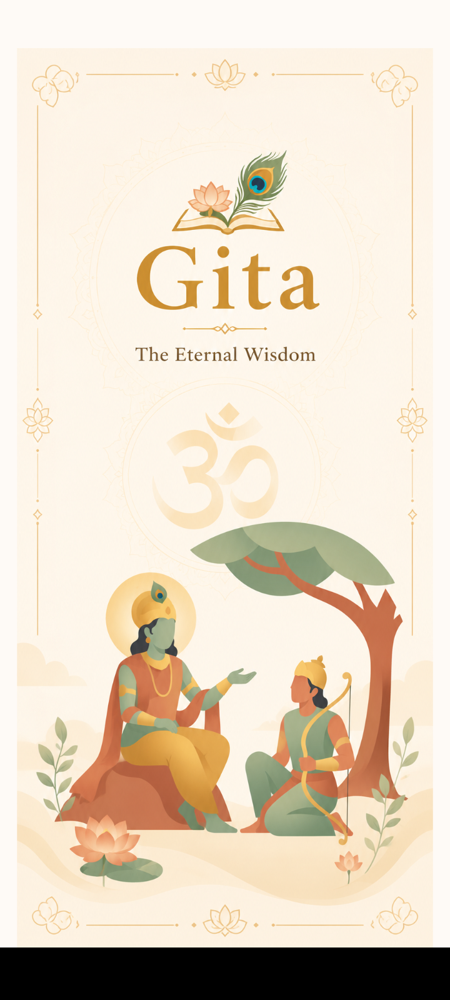 | 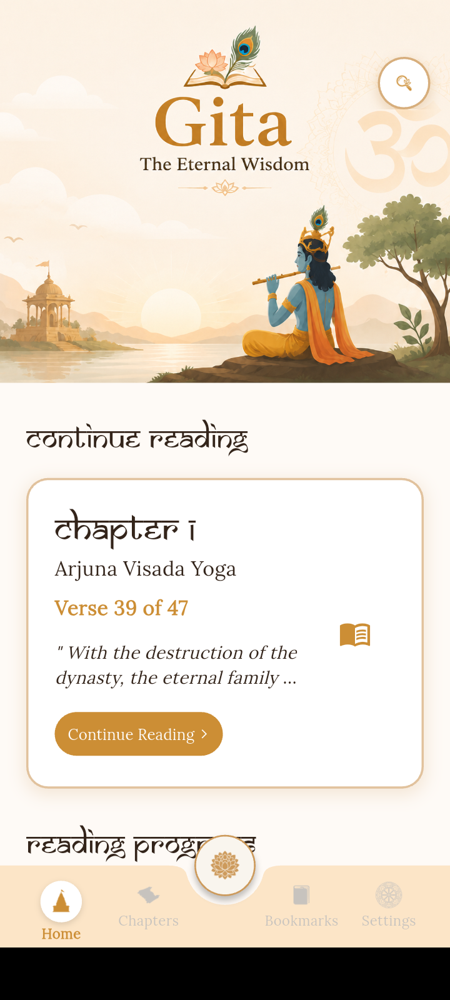 | 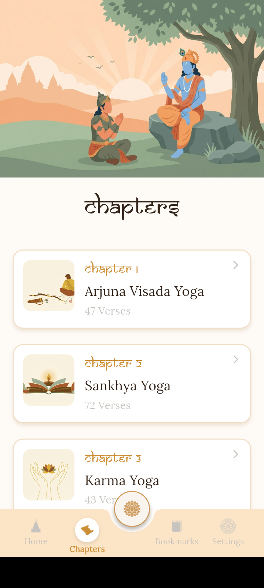 |

| Verse Reader 1 | Verse Reader 2 | Chapter Overview |
|---|---|---|
| 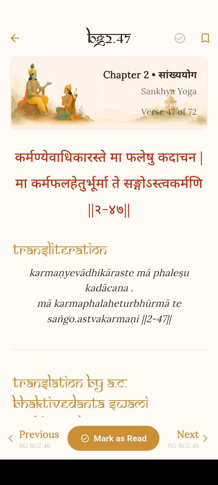 | 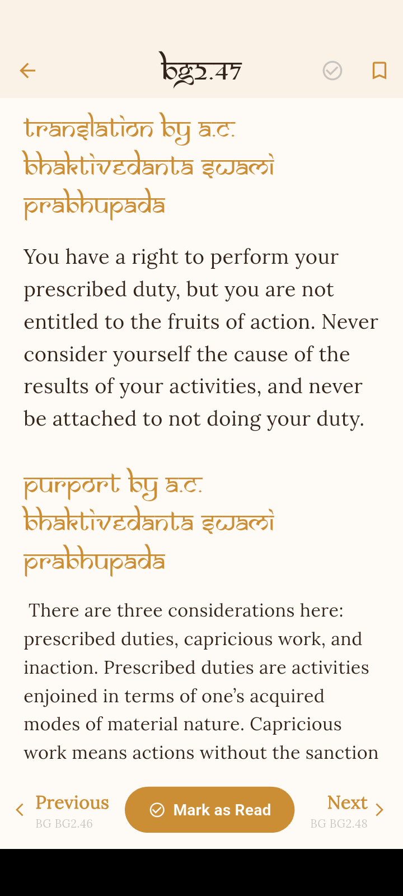 | 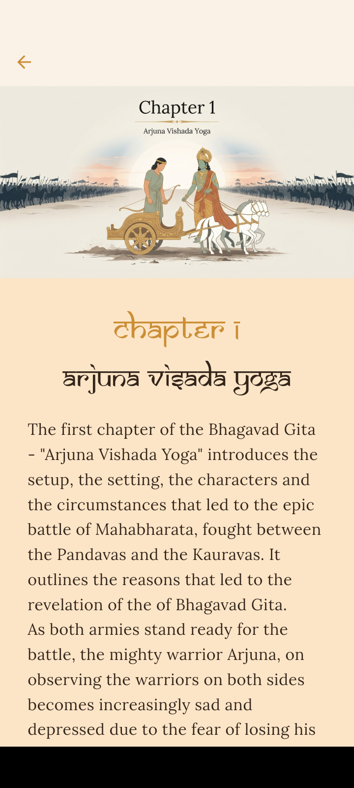 |

| Settings | Translation Preferences | Bookmarks |
|---|---|---|
| 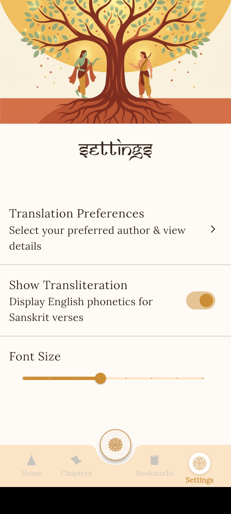 | 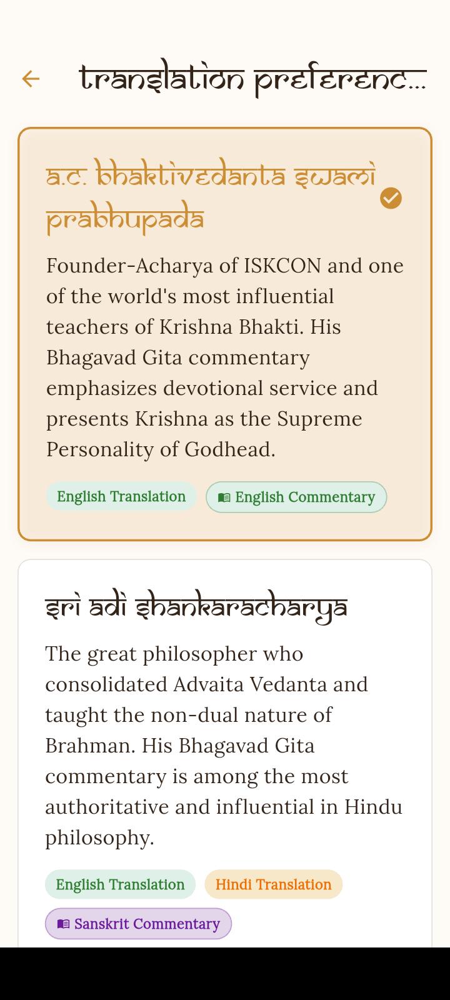 | 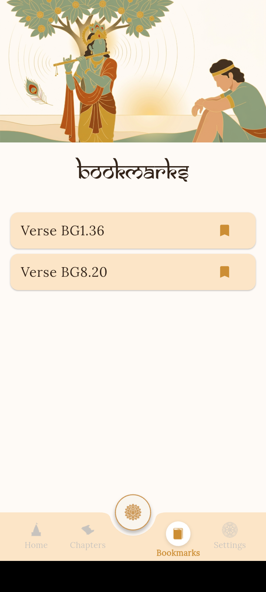 |

| Meditation Mode | Chapter View 2 | Verses |
|---|---|---|
| 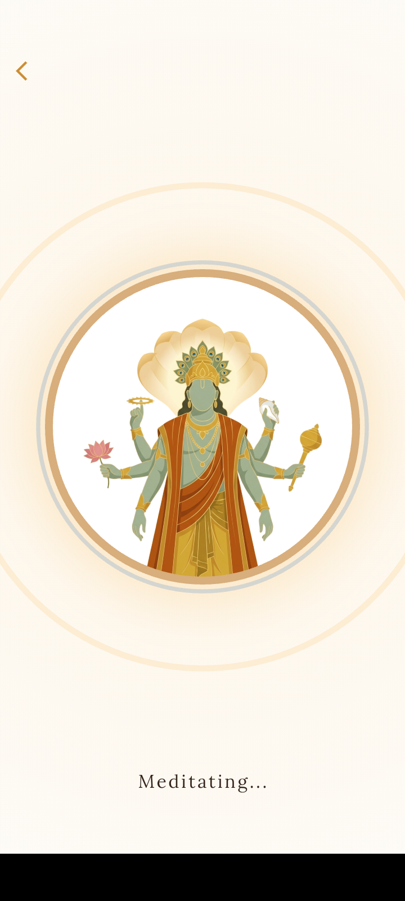 | 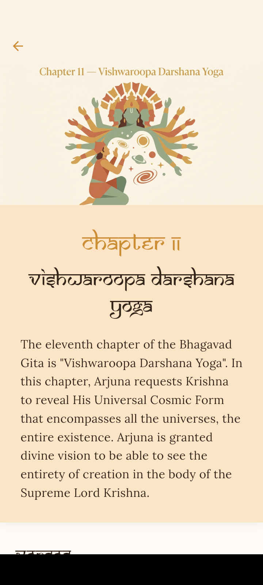 | 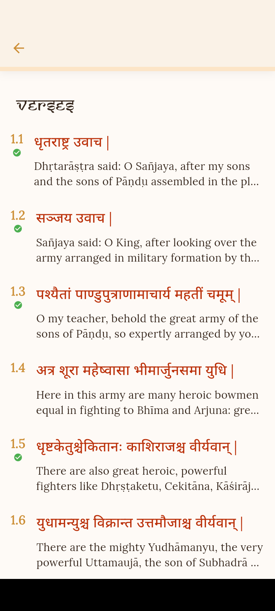 |

*(Drop PNGs into a `/screenshots` folder in the repo with these exact names and the links above will work.)*

## 🛠 Built With

- [Flutter](https://flutter.dev) / Dart
- Fully local data storage — no backend, no runtime network calls
- Custom flat-vector illustration set, generated to a locked style guide for visual consistency across every screen and chapter

## 📥 Download

- **Android APK:** [Latest Release (v1.0.0)](https://github.com/GSMS-B/Gita-The-Eternal-Wisdom/releases/tag/v1.0.0)
- **itch.io:** [gsms-b.itch.io/gita-the-eternal-wisdom](https://gsms-b.itch.io/gita-the-eternal-wisdom)

### Installing the APK

1. Download the `.apk` from the link above
2. Android may show an "unrecognized app" warning — this is expected for apps outside the Play Store, not a sign of a problem. Allow installation from that source.
3. Install and open — no account, no setup screen

## 💻 Running From Source

```bash
git clone https://github.com/GSMS-B/Gita-The-Eternal-Wisdom.git
cd Gita-The-Eternal-Wisdom
flutter pub get
flutter run
```

Requires the Flutter SDK (`flutter doctor` should show no blocking issues).

## 📖 Translation & Commentary Sources

All verse text, translations, and commentary are sourced from the [vedicscriptures/bhagavad-gita](https://github.com/vedicscriptures/bhagavad-gita) dataset, licensed under GPLv3, which compiles the work of the following 22 authors:

| Author | Offers |
|---|---|
| A.C. Bhaktivedanta Swami Prabhupada | English Translation, English Commentary |
| Swami Sivananda | English Translation, English Commentary |
| Shri Purohit Swami | English Translation |
| Dr. S. Sankaranarayan | English Translation |
| Swami Adidevananda | English Translation |
| Swami Gambirananda | English Translation |
| Shri Ramanuja | Sanskrit Commentary, English Translation |
| Shri Abhinav Gupta | Sanskrit Commentary, English Translation |
| Shri Shankaracharya | Hindi Translation, Sanskrit Commentary, English Translation |
| Swami Ramsukhdas | Hindi Translation, Hindi Commentary |
| Swami Tejomayananda | Hindi Translation |
| Swami Chinmayananda | Hindi Commentary |
| Shri Madhavacharya | Sanskrit Commentary |
| Shri Anandgiri | Sanskrit Commentary |
| Shri Jayatritha | Sanskrit Commentary |
| Shri Vallabhacharya | Sanskrit Commentary |
| Shri Madhusudan Saraswati | Sanskrit Commentary |
| Shri Sridhara Swami | Sanskrit Commentary |
| Shri Dhanpati | Sanskrit Commentary |
| Vedantadeshikacharya Venkatanatha | Sanskrit Commentary |
| Shri Purushottamji | Sanskrit Commentary |
| Shri Neelkanth | Sanskrit Commentary |

**Attribution:** none of this translation or commentary text is original to this project. Full credit belongs to the original authors and to the maintainers of the `vedicscriptures/bhagavad-gita` dataset for compiling it. This app is a reading interface built on top of that work, distributed under the same GPLv3 terms (see [License](#-license) below).

## 🌐 Language Available

Currently supported: Sanskrit, English, and Hindi (across the 22 sources above, coverage varies by author — see table). A Telugu translation is on the wishlist but not yet included — I haven't found an existing structured, verse-by-verse open dataset for it yet. If you know of one, or want to contribute one, please open an issue or PR.

## 🗺 Known Limitations

- No audio recitation yet 
- No iOS build published yet
- Not every translator covers every chapter/verse identically — some sources use slightly different verse divisions (e.g. 46 vs 47 verses in a chapter across different editions)

## 🤝 Contributing

Issues and PRs are welcome — especially additional translation sources (with clear attribution/licensing for whatever you add) or a Telugu translation if you find or produce one.

## 📄 License

This project is licensed under the **GNU General Public License v3.0** (GPLv3) — see the [LICENSE](LICENSE) file for the full text. This is a copyleft license: you're free to use, modify, and redistribute this project, but any distributed version (including forks) must remain under GPLv3 too, consistent with the license of the underlying verse dataset this project builds on.

## 🙏 Acknowledgments

- All 22 translators and commentators listed above, and everyone who preserved and transmitted these teachings across generations
- The maintainers of [vedicscriptures/bhagavad-gita](https://github.com/vedicscriptures/bhagavad-gita) for compiling and open-sourcing the dataset
- Everyone who tested early builds and gave feedback

---

<div align="center">

*If this app helped you sit with a verse a little longer, that's the whole point.*

</div>
